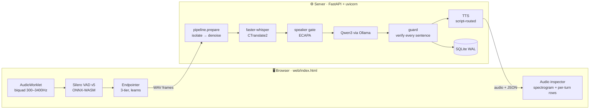

# ZenSuvidha OSS — Architecture

An offline voice receptionist for Indian small businesses. Everything runs on the
operator's own machine: no cloud, no API keys, no per-minute cost.

This document is written to be **falsifiable**. Where a number appears, it was measured
on this codebase; where a decision was made, the measurement that decided it is stated.
Several values here overturned an assumption, and those are called out — a threshold
tuned against the wrong audio is worse than none, because it looks authoritative.

---

## 1. The shape of it



One WebSocket per call. Audio goes up as WAV frames; replies come back as JSON control
messages interleaved with binary audio, so the caller hears sentence 1 while sentence 2
is still being generated.

> **[ARCHITECTURE.html](ARCHITECTURE.html)** is this whole document as one laid-out
> technical sheet — the topology, the signal chain, the stack table, the measured
> envelope, the latency budget and all nine diagrams rendered inline, in a browser.
> It is pre-rendered, so unlike the version it replaced it needs no network.
> **[ARCHITECTURE.excalidraw](ARCHITECTURE.excalidraw)** and
> **[ARCHITECTURE-pipeline.excalidraw](ARCHITECTURE-pipeline.excalidraw)** are the two
> drawings, editable on [excalidraw.com](https://excalidraw.com).
> **[docs/DIAGRAMS.md](docs/DIAGRAMS.md)** has it as nine Mermaid diagrams — the turn
> sequence, the isolation decision tree, the speaker-gate state machine, the noise
> router, the guard chain, TTS routing and the never-wedge protocol.

---

## 2. One turn, end to end

```
caller speaks
     │
 ┌───▼─────────────────────────── BROWSER ────────────────────────────────────┐
 │ getUserMedia   echoCancellation ON · noiseSuppression ON · autoGain OFF     │
 │                └ AGC rescales the very signal the VAD's floor adapts to.    │
 │                                                                            │
 │ AudioWorklet ──┬─ raw pcm ──────────────────────────────► sent to server   │
 │  (off the main │                                                           │
 │   thread, so a └─ biquad 300–3400Hz ─► rmsBand ─► level gate ONLY          │
 │   busy UI can     2.79× noise rejection measured. Whisper never sees       │
 │   never drop      band-limited audio.                                      │
 │   mic frames)                                                              │
 │                                                                            │
 │ Silero VAD v5      "is this speech?" — never "whose?"                      │
 │   needs the previous frame's last 64 samples prepended; without that it    │
 │   scores 0.11 on clear speech instead of 0.99, and looks fine doing it.    │
 │                                                                            │
 │ ENDPOINTER — the window depends on what they said                          │
 │   short answer ("haan", a phone number) ······  800 ms                     │
 │   long enough to HAVE a middle (>1.5s) ······· 1200 ms                     │
 │   learns per caller, up to ··················· 2000 ms                     │
 │   transcript SOUNDS unfinished ··············· +900 ms                     │
 │                                                                            │
 │ LATCH GUARD   7s recorded and never a 260ms pause? People breathe; a       │
 │   speaker at full volume does not. Discard, and ask them to repeat.        │
 │                                                                            │
 │ SELF-ECHO GUARD   barge-in also requires the audio to be LOUDER than a     │
 │   room-attenuated echo of our own output. The browser's AEC hides this     │
 │   today; a telephony transport has no getUserMedia and the agent would     │
 │   interrupt itself in a loop.                                              │
 └────────────────────────────────────────────────────────────────────────────┘
     │  ~3s of audio, typical
 ┌───▼──────────────────── SERVER · pipeline.prepare() ───────────────────────┐
 │                                                                            │
 │ 1. ISOLATE — on RAW audio. Identity is measurably worse on denoised audio  │
 │    (0.675 vs 0.596), and this is the ONLY step that can remove a VOICE.    │
 │                                                                            │
 │      no voiceprint yet? ─────────────────────► skip       (turn 1, 0 ms)   │
 │      pyannote-segmentation-3.0 ─► where each voice starts and stops        │
 │      3D-Speaker ERes2Net ──────► clusters those into "voices"              │
 │                                                                            │
 │      1 cluster, clip <4s ────► done                          (~49 ms)     │
 │      1 cluster, clip ≥4s ────► THIRDS GATE (3 ECAPA passes)                │
 │                                every third is the caller? done  (~124 ms)  │
 │                                else WINDOW RESCAN (≤8 passes)              │
 │      2+ clusters ────────────► score each against the caller's print       │
 │                                keep ≥0.55, or within 0.40 of best AND      │
 │                                ≥0.40 absolute                              │
 │                                one kept? re-check IT for a merge           │
 │                                                                            │
 │ 2. DENOISE — OFF by default. See §5: it costs accuracy as well as time.    │
 └────────────────────────────────────────────────────────────────────────────┘
     │
 Silero VAD v6 (ships free inside faster-whisper) — strips silence before STT.
     │   This is what stops Whisper hallucinating "5,5,5,5…" out of noise.
     ▼
 faster-whisper / CTranslate2
     no_speech > 0.85 → drop · avg_logprob < −1.6 → drop
     degenerate run → TRIM first, drop only if nothing real survives
     ▼
 SPEAKER GATE (ECAPA) — must EARN the right to refuse. See §4.
     ▼
 Qwen3-4B via Ollama — forced JSON {kind, say, action}, token-streamed
     ▼
 GUARD — runs ON the stream, because a spoken price cannot be taken back
     kind → echo → repetition → degeneracy → ungrounded numbers → language
     ▼
 TTS — routed by SCRIPT, not by preference
     Latin/Devanagari → Kokoro · everything else → the system voice
```

---

## 3. Where the time goes

M1 Pro, `qwen3:4b` via Ollama (100% Metal), `whisper-small` int8:

| stage | 3 s clip | 6 s clip |
|---|---|---|
| isolate (diarization + ECAPA) | 66 ms | 146 ms |
| speaker gate | 34 ms | 54 ms |
| **STT** | **1070 ms** | **1168 ms** |
| LLM first token (English) | 400–600 ms | |
| TTS, first sentence | 385 ms | |

**The audio path is STT-bound.** Isolation is ~6 % of it. Four attempts to speed it
further were measured and rejected:

- ECAPA on **MPS** — fails outright; SpeechBrain keeps internal CPU tensors
- **Batching** the thirds gate — a real 1.5×, but on a 60 ms stage
- **CTranslate2 `cpu_threads`** — *more is worse* on Apple silicon: auto 1691 ms,
  4 threads 1601 ms, 8 threads 2212 ms, 10 threads 3798 ms. Do not "tune" this.
- **STT `fast` mode** (beam 1) — not reliably faster

Indic latency is **tokenizer inflation, not runtime**: at 38.7 tok/s a 40-token reply is
1.03 s in English, 3.62 s in Hindi, 6.41 s in Telugu. No inference library fixes that —
MLX benchmarked at 39.6 tok/s against Ollama's 38.7 and was rejected.

---

## 4. The speaker gate, and why it is so cautious

It answers "is this the person whose call this is?". It has caused more user-visible
failures than anything else here, and every fix has moved it toward refusing *less*.

**The measurement that explains all of them:**

```
macOS `say` voices   same speaker 0.867   closest impostor 0.429   → 0.55 works
a real microphone    same speaker 0.27–0.41                        → 0.55 refuses them
```

The threshold was calibrated on synthetic audio. On a real mic, in a room measured
*clean*, a caller's own consecutive turns scored 0.37 / 0.27 / 0.29 / 0.41 — never once
above it. So two independent conditions must now hold before anyone is refused:

- **proven** — it has matched this caller at least once *on this call*. A gate that has
  never recognised them has no evidence it can; refusing on that is a coin toss.
- **corroborated** — the print is more than one un-corroborated sample.

While either is missing, a mismatch is *answered* and the voice remembered as a
**rival**. A rival that returns twice becomes the caller: the voice having the
conversation is the caller, and a song does not follow up on its own question.

Related repairs, each from a live failure:

- **`_voiced_only` used to splice out the gaps between words.** Every join is an
  artificial transient — it scored the caller **0.450 against their own voice**, below
  threshold. Keeping the voiced *span* gives 0.843. Our own trimming was refusing them.
- A print built from a music-contaminated first turn is repaired by near-miss widening,
  and a turn that repairs it must not burn the provisional clock.
- The re-enrolment rescue may not adopt a clip known to hold two or more voices.

---

## 5. Noise: rejection-first, not reduction-first

Of the layers that touch noise, only two modify the signal. The rest refuse to act.

**Auto-denoise is OFF, and this is measured.** DeepFilterNet across 6 interference types
× 5 SNRs — 30 conditions:

```
DeepFilter WON 1 cell, LOST 8, tied 21    net −400 % word recall
white hiss −50 %    fan/AC −67 %    music+vocals −100 %
```

It is also the most expensive stage (226–475 ms). On the recognition path it costs time
*and* accuracy — the same verdict `noisereduce` got (0.00 WER delta, and it made the
speaker gate worse). Whisper trained on 680k hours of messy audio; it does not need help.

The UI toggle still forces it for A/B; `stt.auto_denoise: true` restores the router.

**What the system survives** (caller-relative SNR — words kept *and* caller recognised):

| interference | works down to |
|---|---|
| mains hum 50 Hz | −6 dB |
| traffic rumble | −6 dB |
| music, no vocals | −6 dB |
| another speaker | 0 dB |
| pink / room tone | +3 dB |
| music **with vocals** | +3 dB |
| TV / babble | +3 dB |
| white noise | +6 dB |
| **fan · AC** | **+12 dB** |

Two patterns: low-frequency and tonal interference is nearly free, broadband (fan, hiss)
is expensive. And **anything containing a human voice takes out the speaker gate before
it takes out the transcript** — the words usually survive; recognising them as *yours*
is what fails.

---

## 6. The guard

Prompt rules do not hold a 4B model. Every reply is verified before it is spoken:

| check | what it catches |
|---|---|
| `kind` | the model's own "unknown / out_of_scope / unclear" → a pre-written refusal in 12 languages |
| echo | answering *as* the caller ("मेरा नाम मिश्रा है" back at someone giving their name) |
| repetition | parroting the previous turn |
| degeneracy | a clause looping — caught as the second copy appears, so it is never heard |
| ungrounded numbers | a price in neither the pack nor the call |
| language | a reply in the wrong script |

It runs **on the stream**: a bad sentence is intercepted before synthesis, because on a
call you cannot un-say a price. Mid-booking it never refuses outright — the caller is
answering *our* questions — unless they asked something, in which case they get an
honest "I'll check" **plus** the next slot question.

---

## 7. Files

| file | what it owns |
|---|---|
| `zensuvidha/server.py` | WebSocket protocol, turn orchestration, streaming, idle handling |
| `zensuvidha/pipeline.py` | the audio front-end as one ordered stage — isolate, then denoise |
| `zensuvidha/diarize.py` | speaker segmentation + the ECAPA second opinion |
| `zensuvidha/speaker.py` | the voiceprint gate; `_voiced_only` trimming |
| `zensuvidha/denoise.py` | DeepFilterNet wrapper — the Rust binary, never the pip wheel |
| `zensuvidha/stt.py` | faster-whisper provider, confidence gates, decode-size cap |
| `zensuvidha/orchestrator.py` | `Session` — history, slots, language lock, verification |
| `zensuvidha/guard.py` | grounding checks and the pre-written lines |
| `zensuvidha/tts.py` | providers, script routing, the fallback chain |
| `zensuvidha/packs.py` | industry packs (YAML), path-traversal hardened |
| `web/index.html` | the whole client: VAD, endpointer, playback, inspector |
| `web/vad-worklet.js` | AudioWorklet — biquad + frame emission |

---

## 8. Protocol

Client → server: `text` · `commit` · `stt_hint` · `cancel` · `switch` · `lang` ·
`voice` · `model` · `isolate_mode` · `denoise_mode` · `stt_mode` · binary WAV frames.

Server → client: `session` · `greeting` · `reply_start` · `chunk` / `pcm` ·
`reply_end` · `partial` · `commit_miss` · `turn_dropped` · `audio_insight` · `error`.

Two of those exist purely so a call can never wedge:

- **`commit_miss`** — the client discards its recording when it commits on a speculative
  transcript. If the server has nothing, it must say so, or both sides wait forever.
- **`turn_dropped`** — the client enters "thinking" the moment it ships audio and only
  leaves on a reply. Every path that declines to answer has to say so. Silence is often
  the right *reply*; it is never the right *protocol*.

---

## 9. What is not solved

- **Fan/AC needs +12 dB** — you must be four times louder than a ceiling fan, and
  denoising cannot rescue it (measured −67 %).
- **Five languages have no voice** on macOS: Malayalam, Gujarati, Punjabi, Odia, Urdu.
  The caller sees the reply and hears nothing. Warned at boot; fixed only by the GPU
  preset with Indic-Parler.
- **Loud audio at the mic destroys the voiceprint** (0.07 on the caller's own voice).
  Mitigated — the latch guard cuts it and asks for a repeat — not solved.
- **Every remaining threshold is calibrated on synthetic speech.** A real microphone has
  already proved one wrong by more than 2×. Real recordings are the single
  highest-value missing input.
- **No LICENSE file**, and XTTS — a selectable provider — is non-commercial.
