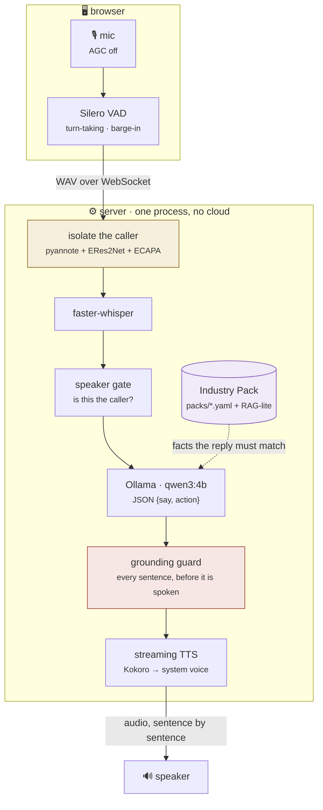
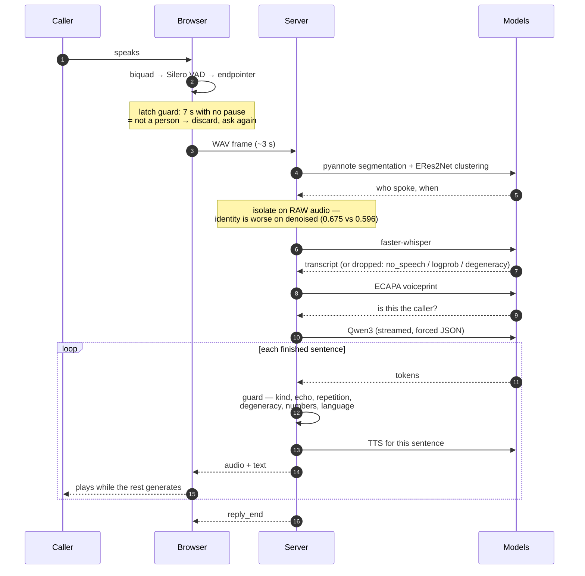
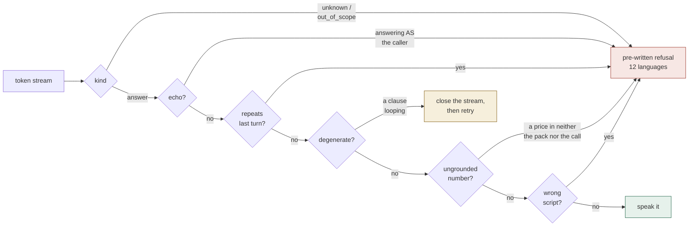

# ZenSuvidha OSS — a free, offline, real-time voice receptionist

An open-source voice-AI receptionist for Indian SMBs that **runs on any laptop** —
no paid APIs, no GPU, no telephony account. It answers calls, books appointments,
answers questions from a deep knowledge base, and escalates to a human — and the
**industry is a swappable data pack** (clinic, salon, restaurant, laundry, gym, hotel…).



Isolation and the guard are the two boxes that took the longest and are the reason
this works on a real call: one decides *whose* words reach the recogniser, the other
decides whether a sentence is true enough to say out loud.

Everything runs locally — the caller's data never leaves the machine (India-residency by construction).

### See it working

Two unedited recordings of a clinic booking, both with audio, in **[`demo/`](demo/)**:

| | | |
|---|---|---|
| **[demo.mp4](demo/demo.mp4)** | 4 min 49 s | a full booking **with music playing in the background** — voice isolation on, inspector showing what it removed each turn |
| **[demo2.mp4](demo/demo2.mp4)** | 4 min 07 s | the same flow recorded close to the screen, so the conversation and the per-turn inspector rows are readable |

Worth watching for: the agent starts speaking before it has finished writing; it refuses
to invent a slot list rather than making one up; and a turn it genuinely cannot hear is
dropped and re-asked instead of answered. [What each is doing →](demo/README.md)

---

## Highlights

- **Real-time & conversational** — streams the reply sentence-by-sentence; you hear audio while it's still thinking.
- **Hands-free + barge-in** — press *Start call* and just talk; interrupt the agent any time and it stops to listen (like a real call).
- **Pluggable industries** — 6 deep packs; add one by dropping a YAML file, no code.
- **Deep domain knowledge** — each pack has services/prices, situation playbooks, answer policies, and a 13–15 entry knowledge base retrieved per-turn (RAG-lite).
- **Natural voices** — a live voice picker (Indian voices first: Aman, Rishi, Tara, Lekha…); each business gets its own voice.
- **Robust** — every reply is fact-checked against the pack before it is spoken (see [the grounding guard](#the-grounding-guard-zensuvidhaguardpy)); plus retries, warm-pooled models, graceful degradation, per-turn latency metrics.
- **Free & offline** — faster-whisper (STT) + Ollama (LLM) + OS/Piper/Kokoro (TTS).

---

## Setup

**Requirements:** Python **3.10–3.12** (faster-whisper / pyttsx3 wheels don't cover
3.13–3.14 yet), [Ollama](https://ollama.com), ~4 GB of disk, and a microphone.
No GPU, no API key, no telephony account.

### Option A — Docker (brings up Ollama too, one command)

```bash
git clone https://github.com/manumishra-zm/zensuvidha-oss.git
cd zensuvidha-oss
docker compose up --build      # waits for Ollama, pulls the model, starts the app
```

Open **http://localhost:8000**. Docker pins Python 3.11, so the voice stack always works.

### Option B — local

```bash
# 1 — get the code
git clone https://github.com/manumishra-zm/zensuvidha-oss.git
cd zensuvidha-oss

# 2 — the language model  (~2.5 GB)
ollama pull qwen3:4b            # NOT qwen2.5 — it has no Telugu (see Languages below)

# 3 — everything else: venv, deps, and the model files
make setup                      # ≈ 4 GB, a few minutes on a first run

# 4 — run it
make web                        # → http://localhost:8000
```

Then open **http://localhost:8000**, pick a business, and click **Start call**.
Check `http://localhost:8000/health` if anything looks wrong — it reports which
providers actually loaded.

Prefer the text CLI? `make run PACK=clinic` — no microphone needed.

### What `make setup` does, and what you lose if you skip a part

It is four steps you can also run individually. Each degrades *gracefully* — the app
still answers calls without any of them — so it is worth knowing what each one buys.

| Step | Gives you | Without it |
|---|---|---|
| `make install` | core: FastAPI, faster-whisper, sherpa-onnx, system TTS | nothing runs |
| `make voice` | Kokoro (the default voice) + speaker identity — **pulls torch, ~530 MB** | the OS voice speaks instead (~1 s slower per sentence), and the speaker gate fails open: **every** voice is answered |
| `bash scripts/download_vad.sh` | Silero VAD in the browser (~13 MB) | turn-taking falls back to an energy threshold — noticeably worse in a noisy room |
| `bash scripts/download_diarize.sh` | voice isolation models (~45 MB) | a colleague or a TV talking in a gap lands in the transcript |

Two optional extras, both off by default:

```bash
bash scripts/download_deepfilter.sh   # DeepFilterNet, for the A/B toggle in the UI
bash scripts/download_piper_voice.sh  # a Piper voice, if you prefer it to Kokoro
```

Running it on a phone needs HTTPS — see [On your phone](#on-your-phone-same-wi-fi).

---

## Using it (the web UI)

The interface is two panels — a control card with an **animated voice orb**, and the **conversation**.

1. Pick a **Business** (industry pack) and optionally a **Voice**.
2. Click **Start call**, allow the mic, then **just speak** — the orb shows **LISTENING → THINKING → SPEAKING**.
3. **Interrupt anytime** — start talking while it's speaking and it stops to listen (barge-in).
4. Or **type** in the box at the bottom. **End call** stops the mic; **Clear** resets the session.

Bookings you make are saved and viewable at `/bookings`.

### Text CLI
```bash
python -m zensuvidha.cli --pack restaurant          # text only
python -m zensuvidha.cli --pack clinic --speak      # also speaks replies
```

### On your phone (same Wi-Fi)
Mobile browsers need **HTTPS** for the microphone, so use the mobile runner (it makes a
one-time self-signed cert and prints your phone URL):
```bash
bash scripts/run_mobile.sh
# → open https://<your-computer-ip>:8000 on the phone, accept the security warning, tap Start call
```
The UI is fully responsive (single-column, large tap targets, no zoom-on-focus).

---

## The Industry Pack (the whole idea)

A pack is **pure data** in `packs/<name>.yaml`, layered over `packs/_base.yaml`.
**Adding an industry = adding a YAML file. No code changes.**

```yaml
name: "Clinic Receptionist"
voice: "Tara"                  # per-business natural voice
persona:  { role: "the front-desk receptionist", style: "calm, caring" }
business: { name: "Suvidha Clinic", hours: "Mon–Sat 9–8", phone: "+91 …" }
greeting: "Namaste, thank you for calling Suvidha Clinic…"

booking:                       # fields to collect + the question to ask for each
  required: [name, phone, doctor, datetime]
  slots: { doctor: "Which doctor — GP, Skin, or Cardiology?" }

services:                      # menu/catalogue → always in the prompt (grounds pricing)
  - { name: "Dermatology — Dr Mehta", price: "₹700 consult" }

policies:                      # answer-structuring rules the agent always follows
  - "You are a receptionist, NOT a doctor: never diagnose or prescribe."

scenarios:                     # situation playbooks (name → what to do)
  - { name: "Emergency", do: "Escalate immediately; do not book." }

vocabulary: ["MRI", "Dr Sharma"]        # STT boost words

escalation:                             # hard, instant, deterministic handoff
  keywords: ["chest pain", "emergency"]
  message:  "Connecting you to our medical staff…"

knowledge:                              # deep KB — retrieved per-turn (RAG-lite)
  - { q: "Do you accept insurance?", tags: ["mediclaim"], a: "Yes, most cashless providers…" }
  - { q: "What are your timings?", core: true, a: "Mon–Sat, 9am to 8pm." }   # core: always kept
```

Ships with **6 packs**: clinic · salon · restaurant · laundry · gym · hotel.
Copy any pack, edit, restart — it appears in the CLI and UI automatically.

---

## How it works

One WebSocket per call. The reply is generated *and spoken* sentence by sentence, so
the caller hears sentence one while sentence two is still being written.



| Concern | Approach |
|---|---|
| **Latency** | LLM streamed → each finished sentence is synthesised and played immediately (low time-to-first-audio). |
| **Warm-pool** | STT/TTS/LLM loaded + warmed at startup; `keep_alive` pins the model in RAM. |
| **Turn-taking** | Browser VAD detects speech start/end — no push-to-talk. Silero if vendored (`bash scripts/download_vad.sh`), adaptive noise-floor energy otherwise. Endpoint is 800 ms, because people pause before saying a phone number. |
| **Speculative STT** | At 450 ms of silence the utterance is transcribed *while the caller may still be pausing*. Resume → discarded; done → the words are already on the server. Buys back the latency of the safer 800 ms endpoint. Partials never reach the LLM — the guard grounds numbers against complete words. |
| **Barge-in** | Speaking over the agent stops playback instantly and cancels the in-flight reply server-side. |
| **Knowledge** | Services/policies/scenarios are always in the prompt; the big KB is retrieved per-turn by token overlap + tags. |
| **Structured output** | LLM runs in JSON mode → reliable `{say, action}` envelope even from a 3B model. |
| **Safety** | Emergency keywords trigger a deterministic human handoff without waiting on the model. |
| **Silence handling** | Client loudness gate + Whisper VAD + degenerate-output guard kill "5,5,5…" hallucinations. |
| **Grounding** | Every reply is checked against the pack's facts *before* it is spoken — see below. |
| **Voice isolation** | A colleague or a TV talking in a gap used to drag whole-clip similarity 0.867 → 0.34 and the caller's own turn was thrown away. Segmentation (pyannote-3.0) + clustering (ERes2Net) + an ECAPA second opinion now trim the turn to the caller. All 9 interference shapes clean. |
| **Noise** | Rejection-first, not reduction-first. Auto-denoise is **off**: swept across 30 conditions DeepFilterNet won 1, lost 8, tied 21 — it costs accuracy *and* 226–475 ms. The toggle stays for A/B. |
| **Speaker ID** | The gate must *earn* the right to refuse — it has to match the caller once on this call first. The 0.55 threshold was calibrated on synthetic voices; a real mic gives the same speaker 0.27–0.41. |
| **Expectation rescue** | A second opinion on identity, *alongside* the voiceprint — pyannote, ERes2Net, ECAPA and DeepFilterNet are unchanged. Loud audio drives the caller's score against their **own** voice to 0.07, at which point every refusal is noise; a turn carrying the ten digits we just asked for is the caller whatever the audio says. It can only ever **rescue** a turn, never discard one. |
| **Never wedged** | `commit_miss` and `turn_dropped` exist so no path can leave the caller watching a spinner. A caller who says nothing is re-prompted at 30 s and released at 75 s. |

### Where the documentation is

| File | What it is |
|---|---|
| **[ARCHITECTURE.html](ARCHITECTURE.html)** | **The single technical sheet — start here.** Nine plates: topology, the signal chain for one turn, the identity gate, the whole open-source stack with what was rejected and why, the measured operating envelope, the latency budget, what is still not solved, and all nine diagrams rendered inline. Self-contained — it needs no network to draw itself. |
| **[docs/EXPLAINED.md](docs/EXPLAINED.md)** | **The walkthrough.** Every component: what it is for, why that one and not the alternatives, and how the audio models actually work at the algorithm level — powerset segmentation, attentive statistics pooling, ERB gains and complex deep filtering. ASCII diagrams throughout. |
| **[ARCHITECTURE.md](ARCHITECTURE.md)** | The same system in prose — every measurement behind every choice. |
| **[docs/DIAGRAMS.md](docs/DIAGRAMS.md)** | All **nine** diagrams (three of them are above), rendering inline on GitHub: the call sequence, the isolation decision tree, the speaker-gate state machine, the noise router, the guard chain, TTS routing, the never-wedge protocol. |
| **[ARCHITECTURE.excalidraw](ARCHITECTURE.excalidraw)** | The topology as an editable drawing — drop it on [excalidraw.com](https://excalidraw.com) to rearrange it. |
| **[ARCHITECTURE-pipeline.excalidraw](ARCHITECTURE-pipeline.excalidraw)** | One voice turn as an editable drawing: all 14 stages, what feeds each, and the three never-wedge messages. |
| **[docs/system.html](docs/system.html)** | The earlier pipeline walkthrough. `ARCHITECTURE.html` supersedes it. |

Everything set in a monospace face in those documents was measured on this codebase.
Everything else is judgement.

---

## The grounding guard (`zensuvidha/guard.py`)



It runs **on the token stream** — a bad sentence is intercepted before synthesis,
because on a call you cannot un-say a price.


Prompt rules do not hold a 4B model. Asked for a service the clinic doesn't offer, it
would answer *"neurologist ka consultation fee ₹1,000 hai"* — a confident, fluent,
completely invented price. Asked the distance to Mumbai it would answer in kilometres.
It was worst in Hindi and Telugu, where the model is weakest.

So the engine does not trust the model, it **checks** it. Nothing reaches the caller's
ear until it has passed:

| Check | What it stops |
|---|---|
| **Grounding** | Every number in a reply — fee, phone, timing, distance — must appear in the pack's facts or in something the caller said. A fabricated ₹1,000 is never spoken. |
| **Classification** | The model must first declare `kind` — `answer` / `unknown` / `out_of_scope` / `unclear`. It decides *that* it can't answer; we supply the *words*. |
| **Repetition** | A reply that collapses into repeating one clause (how a small model fails in Telugu) is cut off. |
| **Language** | A Telugu call answered in English is caught and replaced. |
| **Truncation** | Indic scripts cost ~3× the tokens per word, so the budget scales with the language, and any leftover fragment is trimmed to the last whole sentence. |

When a check fails the caller hears a **pre-written line in their own language** —
*"क्षमा कीजिए, यह जानकारी मेरे पास नहीं है…"*, *"नేను రిసెప్షనిస్ట్‌ని, దయచేసి వాటి గురించి అడగండి"* —
never a garbled refusal the model had to compose itself. Twelve languages plus
romanised Hinglish, in `guard.SAFE_LINES`.

On the streaming path each sentence is checked **before** synthesis: on a phone call an
invented price cannot be taken back once it is spoken. Tune or disable any of it under
`guard:` in `config.yaml` (`log_only: true` reports what *would* be blocked without
changing what is said).

---

## Configuration — `config.yaml`

| Stage | Default (free / laptop) | Alternatives |
|---|---|---|
| STT | `faster_whisper` `tiny` int8, VAD on | `base` / `small`; `language: hi` for Hindi |
| LLM | `ollama` `qwen3:4b`, `keep_alive: 30m` | any Ollama model |
| TTS | `system` (macOS `say` / Linux espeak) | `piper`, `kokoro`, **`indic_parler`** (21 Indian langs), or `none` |
| Server | `streaming: true`, timings on | — |
| Guard | all checks on | `log_only: true` to observe; per-check flags to relax |

### Voices

`make voice` installs **Kokoro**, which is the default and the one to use: it runs
in-process and scales with the text (385 ms), where the OS voice costs ~1064 ms of
fixed process spawn however short the sentence.

TTS is routed by **script, not preference** — Kokoro speaks Latin and Devanagari, and
anything else falls through to the OS voice. On macOS the built-in Indian voices
(Aman, Rishi, Tara, Lekha) are used directly and listed in the UI's Voice picker.
Malayalam, Gujarati, Punjabi, Odia and Urdu have no macOS voice at all; the app warns
about this at startup and the UI says why the reply is silent.

Two alternatives, neither installed by default:

- **Piper** — `pip install 'piper-tts>=1.2,<1.3' && bash scripts/download_piper_voice.sh`,
  then `tts.provider: piper`. Kept out of `make voice` because its `descript-audiotools`
  dependency currently fails to build and took the whole install down with it.
- **Indic-Parler** — the only one here that actually speaks Telugu, Tamil, Kannada and
  Malayalam. A git dependency plus ~2 GB on first run, and slow enough on CPU that it
  belongs to the [GPU preset](#languages-qwen3-4b). Install line is in
  `requirements-voice.txt`.

---

## Project layout

```
zensuvidha-oss/
├── config.yaml               # provider/model + latency knobs
├── docker-compose.yml  Dockerfile   # one-command run (app + Ollama)
├── Makefile  run.sh
├── scripts/                  # docker entrypoint, piper voice downloader
├── packs/                    # ◀ the plug-in layer — add industries here
│   ├── _base.yaml  clinic  salon  restaurant  laundry  gym  hotel .yaml
├── zensuvidha/
│   ├── packs.py              # Industry Pack loader (deep-merge over _base)
│   ├── guard.py              # ◀ grounding guard: fact/language/repetition checks + safe lines
│   ├── orchestrator.py       # Base engine: prompt, RAG retrieve, slot-fill, booking, escalation, streaming, barge-in
│   ├── stt.py  llm.py  tts.py   # provider adapters (streaming, cache, silence guards, voice override)
│   ├── booking.py            # SQLite store (WAL) — stands in for calendar/POS/EMR
│   ├── cli.py                # text CLI
│   └── server.py             # FastAPI: streaming WebSocket, cancellable turns, warm-pool, /voices, metrics
├── web/index.html            # two-panel UI: voice orb, VAD + barge-in, scheduled playback
├── web/vad-worklet.js        # mic framer on the audio thread (32ms hops, 512@16k for Silero)
├── scripts/download_vad.sh   # optional: vendor Silero VAD + onnxruntime-web (~13MB, offline)
└── tests/                    # fast tests, no Ollama/STT/TTS needed
    ├── test_engine.py        # engine core: packs, prompt, slots, booking, streaming helpers
    ├── test_streaming.py     # speculative STT protocol + progressive TTS frames
    └── test_guard.py         # grounding: invented fees, repetition, language, safe lines
```

Run tests: `make test` (9 tests, uses a fake LLM).

---

## HTTP / WebSocket API

- `GET /` — the web UI · `GET /health` — status · `GET /packs` · `GET /voices` · `GET /bookings`
- `WS /ws?pack=<name>` — the voice loop. Client → `{type:text|switch|voice|cancel}` or a binary WAV blob.
  Server → `greeting`, `reply_start`, `chunk` (text+audio), `reply_end` (action+timings), `reply` (fallback), `voice_sample`, `error`.

---

## From demo to production

- **Telephony:** put this behind **Bolna / Pipecat / LiveKit** with **Plivo/Exotel** for real phone numbers.
- **Hinglish accuracy:** swap STT to **Sarvam Saaras** or **AI4Bharat IndicConformer**.

### Languages (Qwen3-4B)

The LLM is **`qwen3:4b`** — it reasons and replies in **119 languages**, including most Indian ones
(Hindi, Bengali, Tamil, Telugu, Marathi, Gujarati, Punjabi, Urdu, Kannada, Malayalam…). It's told to
**reply in the same language + script the caller used**, and Qwen3's slow "thinking" mode is kept **off**
(`think: false`) so there's no dead air on a call.

But language reach is set by the **weakest layer**, and that's **TTS** — you can only *speak* a language
you have a voice for:

| Layer | Handles | Reach |
|---|---|---|
| STT (hear) | faster-whisper | ~99 languages |
| LLM (think) | **Qwen3-4B** | **119 languages** |
| TTS (speak) | Kokoro / Piper (default) | ~2 (EN + Hindi) |
| TTS (speak) | **`indic_parler`** (wired in) | **~21 Indian languages** |

**To actually SPEAK the other Indian languages**, switch TTS to the wired-in **AI4Bharat
Indic-Parler-TTS** (free, offline, Apache-2.0 — no api key):

```bash
pip install -r requirements-voice.txt      # pulls torch + parler-tts (~first run downloads ~2GB)
# then in config.yaml:
#   tts:
#     provider: indic_parler
#     device: null            # cuda→cpu auto; set "mps" to try Apple GPU
```

The spoken **language is auto-detected from the text** (Hindi, Tamil, Telugu, Bengali, Marathi, Gujarati,
Punjabi, Urdu, Kannada, Malayalam…); the **voice/style** is set by `tts.indic_description`. Real-time on
GPU; a few seconds/sentence on CPU (cache hides repeats). The LLM upgrade (Qwen3-4B) fixed *reasoning* in
119 languages; this fixes *speaking* in ~21.
- **Integrations:** replace `booking.py` with the vertical's real calendar / POS / EMR, referenced by the pack.
- **Scale & residency:** self-host the whole stack; see the analysis in [`../research/`](../research/) (decision doc: `05-stack-comparison-and-verdict.md`).

---

## Troubleshooting

- **Orb doesn't move / no audio** — click anywhere once (browser autoplay rule); *Start call* covers this.
- **"didn't hear you"** — mic too quiet or wrong input (macOS System Settings → Sound → Input).
- **Voice recognition weak** — `tiny` is demo-grade; set STT `model: base` in `config.yaml`, or use Sarvam/AI4Bharat.
- **Voice not applied on Linux/Docker** — `say` is macOS-only; install a Piper voice for neural TTS there.
- **Ollama errors** — ensure it's running and `ollama pull qwen3:4b` is done; check `/health`.

_100% open-source. Free to run, offline, and India-resident by design._
