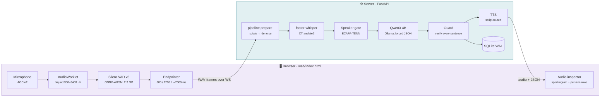
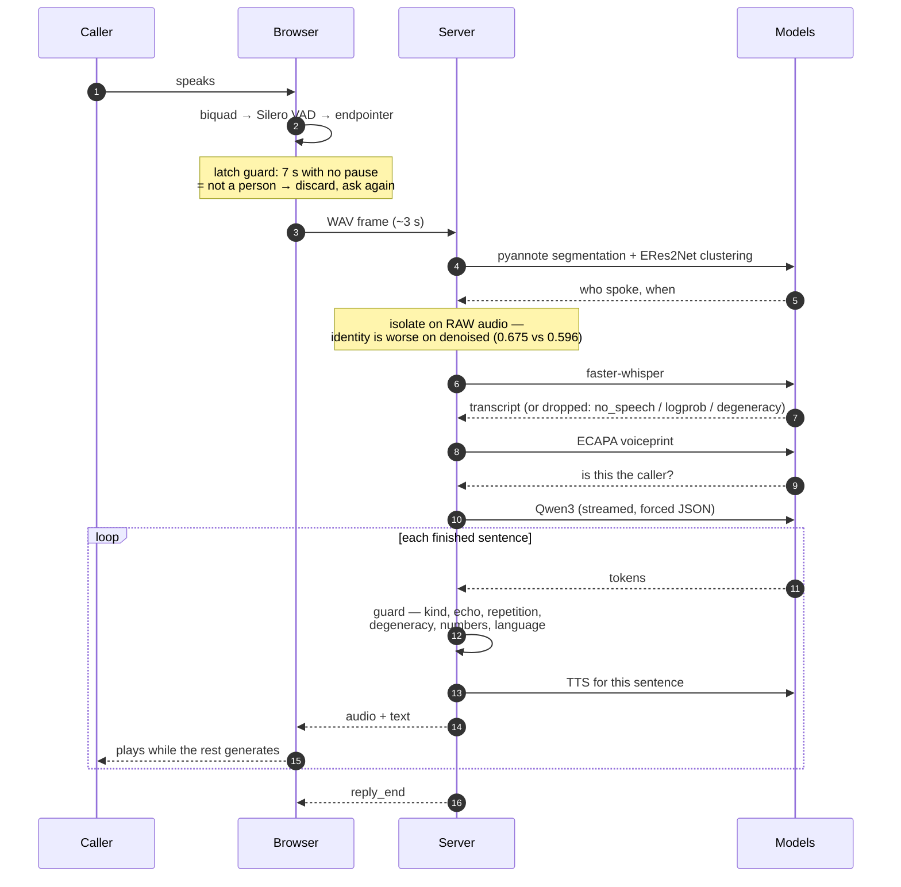
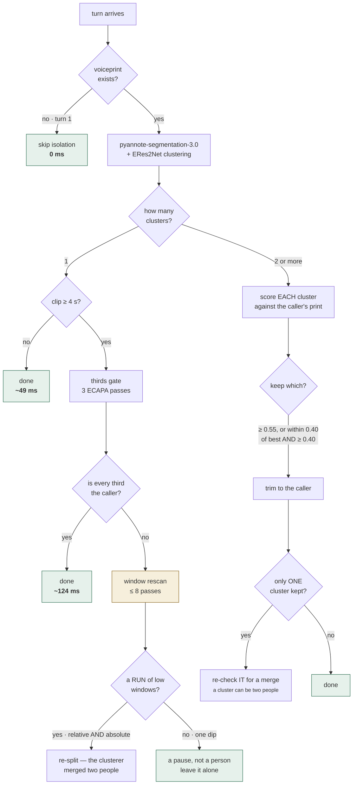
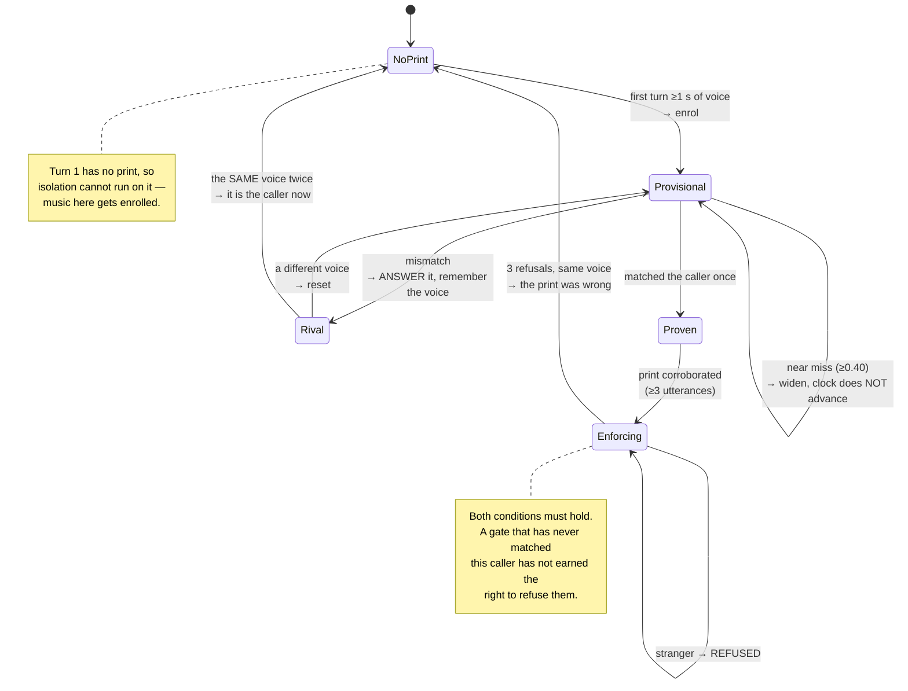
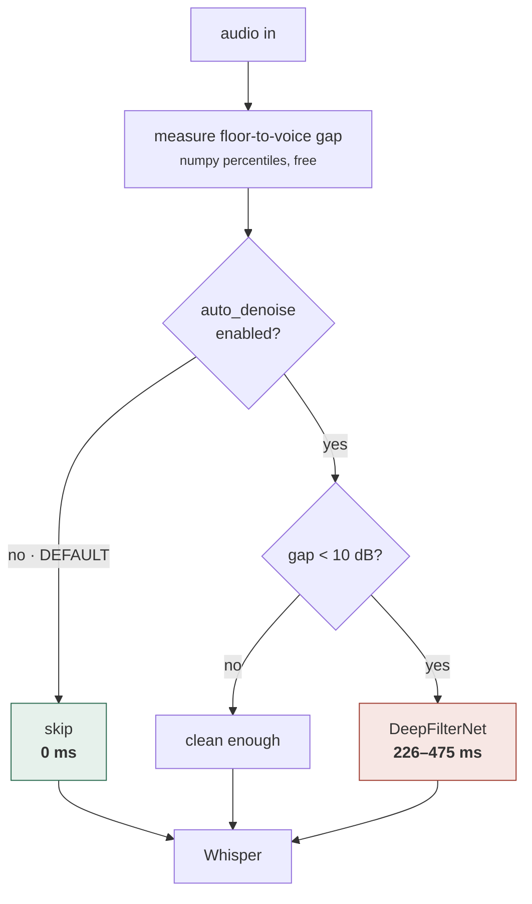
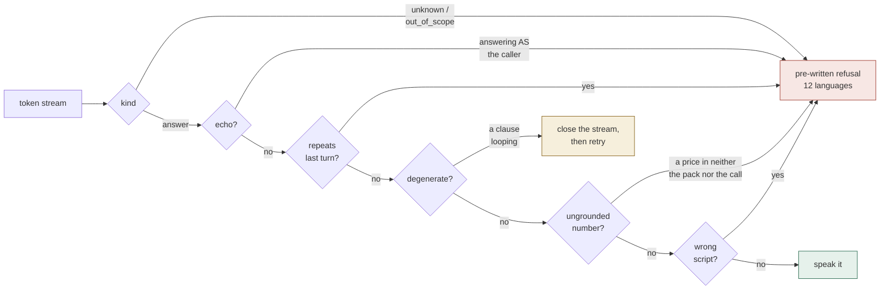
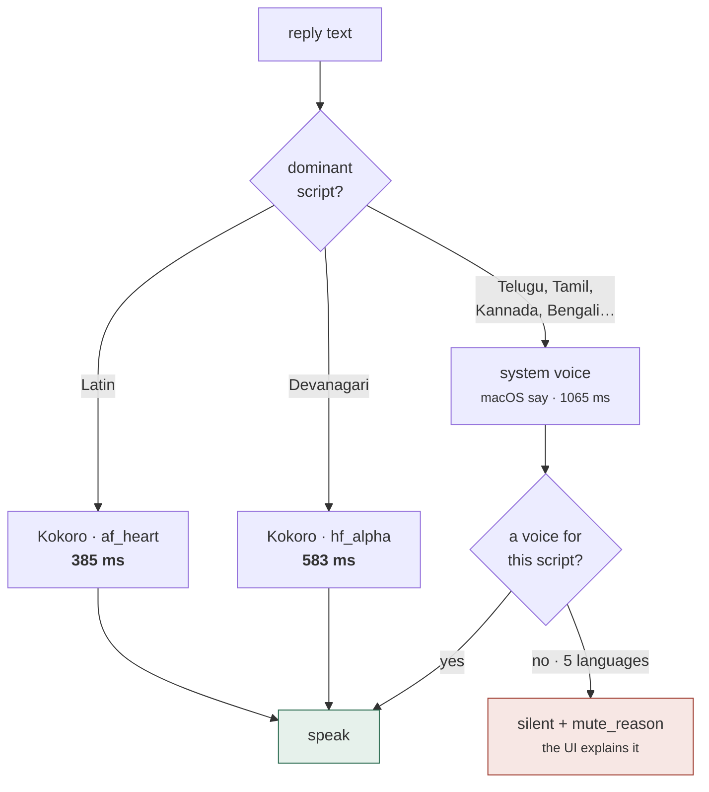
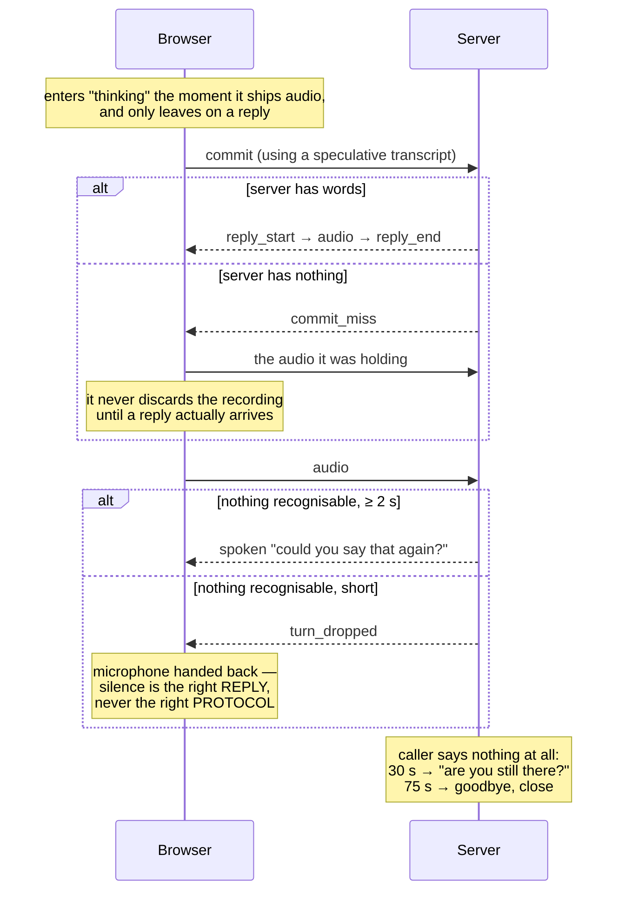
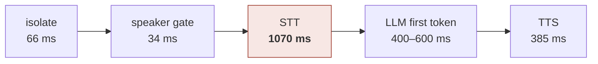

# ZenSuvidha OSS — Diagrams

Every diagram here renders on GitHub. They are the same system described in
[ARCHITECTURE.md](../ARCHITECTURE.md); this file is the visual index. For the whole
thing laid out as one page — including these nine, pre-rendered so they need no
network — open [../ARCHITECTURE.html](../ARCHITECTURE.html); to move
the boxes around yourself, open [../ARCHITECTURE.excalidraw](../ARCHITECTURE.excalidraw)
and [../ARCHITECTURE-pipeline.excalidraw](../ARCHITECTURE-pipeline.excalidraw) on
excalidraw.com.

Numbers shown were measured on an M1 Pro — `qwen3:4b` via Ollama (100% Metal),
`whisper-small` int8.

---

## 1. What talks to what



---

## 2. One turn, in order



---

## 3. Voice isolation — the decision tree

The wide path is the common one. Everything else only fires when its condition holds.



**Why the run test exists.** One caller speaking two sentences dips at her own pause;
a stranger's turn is a *run*. Splitting on the dip deleted 0.8 s of her own words:

```
one speaker, two sentences   0.77 0.78 0.74 0.71 [0.50] 0.66 0.67 0.73 0.66
caller then a stranger       0.77 0.78 0.74 0.71 [0.45  0.52  0.35  0.23]
```

---

## 4. The speaker gate — when it may refuse



**The measurement behind it:**

| | same speaker | closest impostor | verdict at 0.55 |
|---|---|---|---|
| macOS `say` voices | 0.867 | 0.429 | works |
| **a real microphone** | **0.27 – 0.41** | — | **refuses the caller** |

---

## 5. Noise: what runs, and when



**Why the default is off.** Swept across 6 interference types × 5 SNRs — 30 conditions:

```
DeepFilter WON 1 cell, LOST 8, tied 21     net −400% word recall
white hiss −50%      fan/AC −67%      music+vocals −100%
```

It is also the most expensive stage. On the recognition path it costs time *and*
accuracy — the same verdict `noisereduce` got.

---

## 6. The guard chain



It runs **on the stream** — a bad sentence is intercepted before synthesis, because on
a call you cannot un-say a price.

---

## 7. TTS routing — by script, not preference



Fed Telugu, an English Kokoro pipeline produced **2.1 MB and 6.5 seconds** of confident
nonsense — so the script is checked *before* anything is synthesised. Malayalam,
Gujarati, Punjabi, Odia and Urdu have no voice at all on macOS; that is warned at boot.

---

## 8. Why a call can never wedge



---

## 9. Where the time goes



The audio path is **STT-bound**; isolation is ~6% of it. Four attempts to speed it
further were measured and rejected — ECAPA on MPS (fails outright), batching the thirds
gate (1.5× on a 60 ms stage), `cpu_threads` (*more is worse* on Apple silicon: auto
1691 ms, 8 threads 2212 ms, 10 threads 3798 ms), and STT fast mode (not reliably
faster).

Indic latency is **tokenizer inflation, not runtime**: at 38.7 tok/s a 40-token reply is
1.03 s in English, 3.62 s in Hindi, **6.41 s in Telugu**. MLX was benchmarked at
39.6 tok/s against Ollama's 38.7 and rejected. The GPU preset is the answer.
